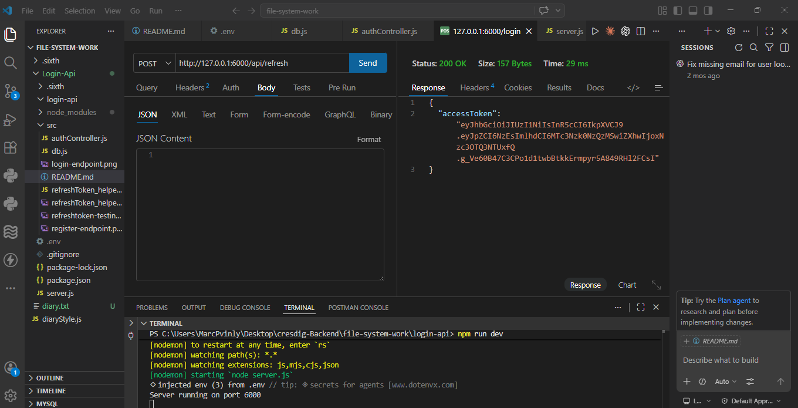
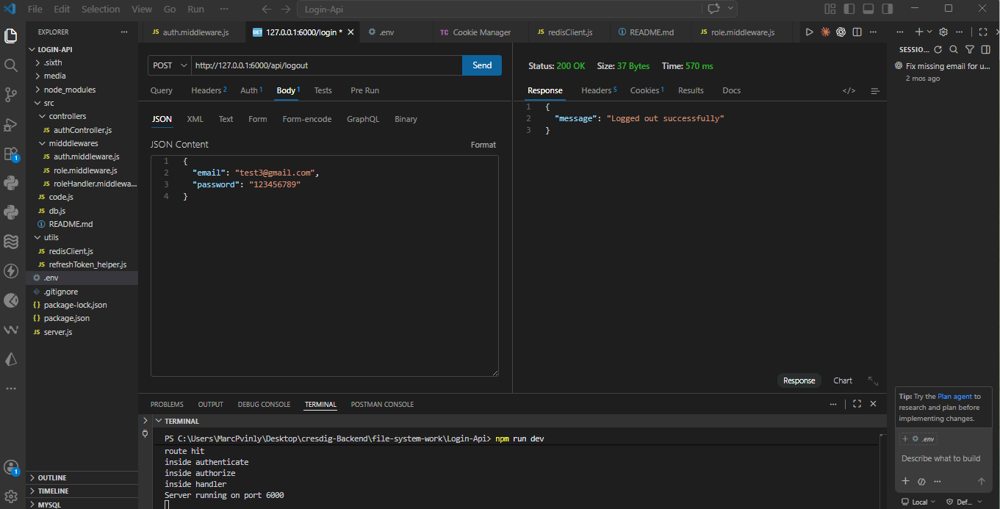
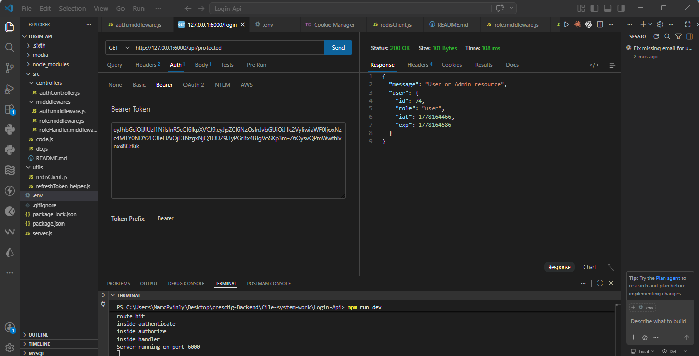
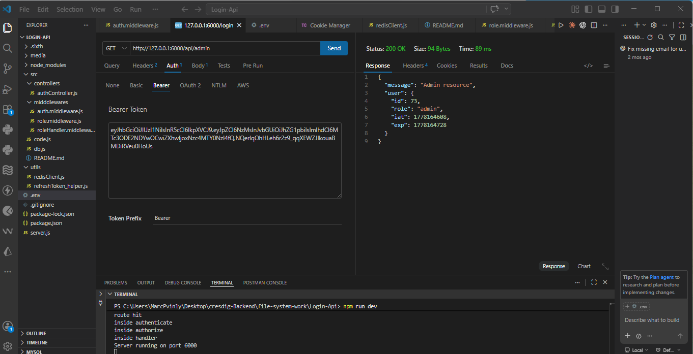

# Login API 🔐

This is a robust backend authentication service built with a focus on security and scalability. It handles user registration, login, session management with refresh tokens, and a secure logout system using Redis.

## 🛠 Features
- **User Registration**: Secure password hashing with Bcrypt.
- **Dual Token System**: Implementation of Access Tokens (short-lived) and Refresh Tokens (long-lived) for better security.
- **Redis Blacklisting**: Real-time token revocation on logout to prevent unauthorized reuse of JWTs.
- **Role-Based Access Control (RBAC)**: 
  - `/api/protected`: Accessible by both Users and Admins.
  - `/api/admin`: Strictly restricted to Admin accounts.
- **Secure Storage**: Cookies used for storing tokens to mitigate XSS risks.

## 💻 Tech Stack
- **Node.js**: Runtime environment.
- **PostgreSQL**: Database for user storage.
- **Redis**: In-memory data store for token blacklisting.
- **Bcrypt**: Password hashing.
- **JSON Web Token (JWT)**: Authentication and session management.
- **Nodemon**: Development tool for auto-reloading.

## 🚦 API Endpoints


| Method | Endpoint | Description | Access |
| :--- | :--- | :--- | :--- |
| POST | `/api/register` | Register a new user | Public |
| POST | `/api/login` | Login and receive Access/Refresh tokens | Public |
| POST | `/api/refresh` | Exchange Refresh Token for new Access Token | Public |
| POST | `/api/logout` | Revoke token and add to Redis blacklist | Private |
| GET | `/api/protected`| Access general protected resources | User/Admin |
| GET | `/api/admin` | Access administrative dashboard | Admin Only |

## 📸 API Testing (Thunder Client)

### Register Endpoint


### Login Endpoint


### Refresh Endpoint


### Logout Endpoint


### Protected Endpoint


### Admin Endpoint


## ⚙️ Setup Instructions
1. **Navigate to the folder**:  
   `cd login-api`
2. **Install dependencies**:  
   `npm install`
3. **Configure Environment Variables**:  
   Create a `.env` file and add:
   ```env
   PORT=6000
   JWT_SECRET=your_access_secret
   REFRESH_SECRET=your_refresh_secret
   POSTGRE_PASSWORD=your_db_password
   REDIS_HOST=redis_host
   REDIS_PORT=redis_port
   ```
4. **Redis Setup**:  
   Ensure your Redis server is running (`sudo service redis-server start`).
5. **Run the server**:  
   `npm run dev`
