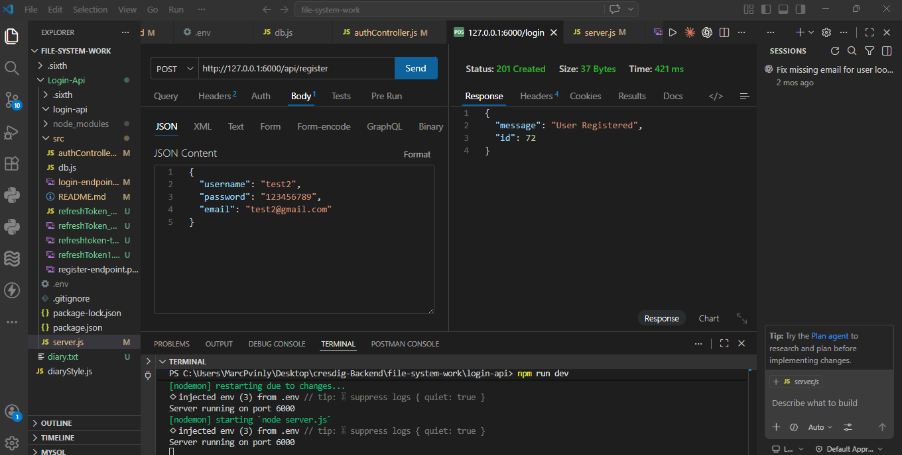
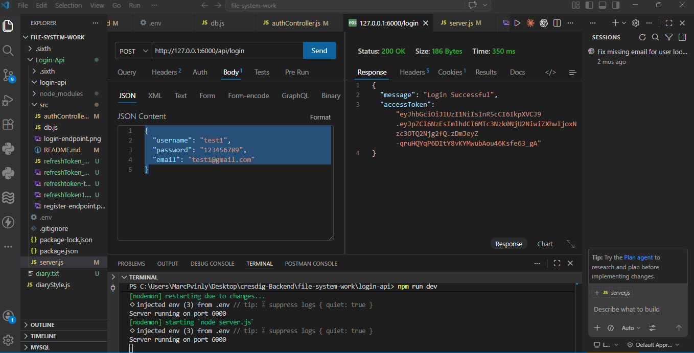

# Login API 🔐

This is a backend authentication service built as part of my coding course. It handles user registration, login, and secure token generation.

## 🛠 Features
- **User Registration**: Hash passwords before saving to the database.
- **Secure Login**: Validates credentials and returns a JWT (JSON Web Token).
- **refresh**: Validates credentials and returns a JWT (JSON Web Token) with addition of refresh token to extend user session.
- **Protected Routes**: Restricts access to specific data unless the user is logged in.

## 💻 Tech Stack
- **Node.js** (Server)
- **Nodemon** (for server auto reload)
- **Bcrypt** (Password hashing)
- **JSON Web Token (JWT)** (Authentication)
- **JSON Web Token (JWT) refresh token** (Authentication)
- **Cookie-parser** (Authentication)
- **PostgreSQL** 

## 🚦 API Endpoints

| Method | Endpoint | Description |
| :--- | :--- | :--- |
| POST | `/api/register` | Register a new user |
| POST | `/api/login` | Login and get a token |
| POST | `/api/refresh` | refresh token |

## API TESTING (THUNDER CLIENT) 

## Register EndPoint

### Login EndPoint

### Refresh EndPoint

## ⚙️ Setup Instructions
1. Navigate to this folder: `cd login-api`
2. Install packages: `npm install`
3. Create a `.env` file and add your `JWT_SECRET`, `REFRESH_SECRET and `POSTGRE_PASSWORD`.
4. Run the server: `npm run dev`
